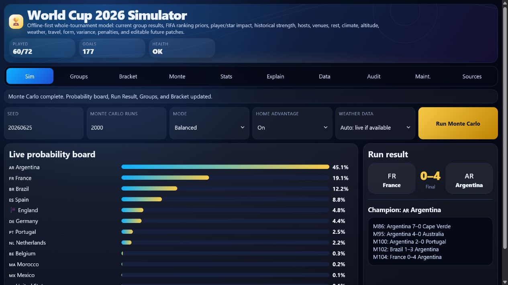

# World Cup 2026 Simulator

**Current Data Version:** shown in the deployed app's Data health view from embedded `BASE_DATA`.

World Cup 2026 Simulator is a static, offline-capable web app for exploring the 48-team, 104-match FIFA World Cup 2026 format. It combines embedded match results, an ensemble prediction engine, venue/weather context, host advantage, seeded randomness, FIFA-style group ranking, knockout rules, and Monte Carlo tournament simulation in one portable HTML file.

[Live Demo](https://shfqrkhn.github.io/FIFA-WC-Sim/)

## Screenshot



## Quick Start

1. Open the live app.
2. On the **Sim** tab, keep the defaults or adjust the scenario name, number of prediction runs, match style, host boost, and weather setting.
3. Press **Run predictions**.
4. Read **Most likely champions** first. This is the quickest summary of the tournament outlook.
5. Review **Sample tournament path** to see one representative bracket path that matches the top Monte Carlo outcome.
6. Use **Groups**, **Bracket**, and **Odds** for more detail.
7. Use **How**, **Data**, **Checks**, **Health**, and **Sources** only when you want deeper transparency or maintenance detail.

## Main Tabs

### Sim

The main screen is designed to answer the most common question first: who is most likely to win?

Controls:

* **Scenario name:** a seed for repeatable results. The same seed and settings produce the same sample tournament path.
* **Prediction runs:** how many Monte Carlo tournament runs to perform. More runs produce smoother probabilities and take longer.
* **Match style:** balanced, steadier, or more upsets.
* **Host boost:** turns host/co-host expected-goal advantage on or off.
* **Weather:** uses live weather if available, venue climate estimates, or no weather adjustment.

### Groups

Shows current group standings, played results, projected upcoming scores, and the best third-place queue. Played matches stay fixed; unplayed matches are filled by the prediction engine.

### Bracket

Shows the projected knockout bracket from the Round of 32 through the final. The bracket wraps across smaller desktop and mobile screens to avoid horizontal scrolling.

### Odds

Shows each team's Monte Carlo probability of winning the cup and reaching later rounds.

### How

Explains the prediction model, coefficients, assumptions, match inputs, expected goals, venue/weather effects, host terms, and scoreline logic.

### Data, Checks, Health, Sources

These are advanced sections. They keep transparency and maintenance information available without crowding the main user flow:

* **Data:** JSON import/export/reset tools.
* **Checks:** built-in regression and tournament-shape self-tests.
* **Health:** data version, validation history, patch history, known risks, and update checklist.
* **Sources:** source list and update protocol.

## How the Prediction Engine Works

The app keeps Monte Carlo as the tournament-level simulator. Under each tournament run, individual matches are predicted by an ensemble match model:

1. **Ranking prior:** FIFA ranking provides a broad strength baseline.
2. **Tournament pedigree proxy:** titles, deep runs, and listed star depth add historical and squad-strength context.
3. **Current form:** embedded tournament points, goal difference, goals for, and goals against adjust teams as results arrive.
4. **Attack/defense profile:** played-match scoring and defending patterns influence expected goals.
5. **Context terms:** venue, climate, weather, rest/travel, host/co-host advantage, and editable match context adjust expected goals.
6. **Scoreline sampler:** expected goals are converted into scorelines with a bounded low-score correlation adjustment, then knockout draws go to extra time and penalties.
7. **Tournament simulation:** group standings, best third-place teams, legal knockout slots, and each knockout round are resolved.
8. **Monte Carlo aggregation:** thousands of runs are counted into champion, finalist, semifinal, quarterfinal, and round-of-16 probabilities.

The displayed sample path is selected from the Monte Carlo run that represents the top champion/finalist pairing, so the main result, Groups, Bracket, and favorites board stay aligned.

### Prediction Audit and Calibration

The maintenance scripts can freeze pre-match model predictions into `data/prediction-audit.json` before results are known. Once match results are embedded, `scripts/score-predictions.mjs` scores those frozen records with Brier score, log loss, scoreline error, calibration bucket, and failure class.

`scripts/update-calibration.mjs` uses only already-settled frozen predictions. Calibration is conservative, remains separate from the base model, and stays disabled as `insufficient_sample` until at least 30 resolved predictions exist. If validation does not improve or tie raw Brier/log-loss performance, calibrated probabilities are rolled back and the app continues to show raw model probabilities.

This audit loop is educational and informational only. It is used to detect overconfidence and calibration drift, not to provide betting advice.

## Data Sources and Updates

The embedded data includes:

* Teams, groups, venues, and knockout slots.
* Played group-stage results.
* FIFA ranking priors, rank-seeded Elo-style ratings, and team-strength assumptions.
* Venue, climate, rest/travel, and weather context.
* Fair-play/team-conduct inputs where available.
* Source notes, validation history, and known data-quality gaps.

### Automated Update Status

Daily auto-update exists at `.github/workflows/daily-base-data-update.yml`.

It runs on:

* `37 11 * * *` UTC: 07:37 America/Montreal during EDT, 06:37 during EST.
* `37 17 * * *` UTC: safety run for delayed feeds or a missed morning run.
* `workflow_dispatch`: manual fallback from GitHub Actions.

GitHub cron is UTC-only and can be delayed or skipped by GitHub infrastructure. The safety run and manual dispatch are intentional; one morning-only run is not sufficient for reliable maintenance.

The workflow runs `node scripts/update-base-data.mjs`, then idempotence, prediction-audit calibration validation, unit tests, and simulation smoke checks. It commits only `docs/index.html`, `data/latest-update.json`, `data/update-health.json`, `data/prediction-audit.json`, and `data/calibration-state.json`, and only after validation passes.

### Automated Sources

The updater currently uses:

* ESPN public soccer scoreboard API for machine-readable completed match scores.
* Open-Meteo for upcoming-match venue weather where available.
* Embedded schedule and venue coordinates for rest/travel context.
* Embedded FIFA ranking fields for the rank-seeded Elo-style model input.
* Official FIFA pages remain the preferred manual authority for fixtures, reports, rankings, regulations, discipline, and disputed data.

### Not Automatically Updated

The updater does not invent unavailable data. These remain neutral unless reliable data is manually patched:

* Lineups, injuries, suspensions, and referee assignments.
* Full disciplinary/fair-play card ledger beyond embedded known conduct notes.
* Official fixture/venue/kickoff rewrites when no stable unauthenticated source adapter is configured.
* Betting odds or gambling-market data, which are not used.

### Manual Update

```bash
node scripts/update-base-data.mjs
```

Use `--no-fetch` for deterministic local repair/enrichment without network calls:

```bash
node scripts/update-base-data.mjs --no-fetch
```

Audit/calibration maintenance can also be run one step at a time:

```bash
node scripts/freeze-predictions.mjs
node scripts/score-predictions.mjs
node scripts/update-calibration.mjs
node scripts/validate-calibration.mjs
```

### Local Validation

```bash
python scripts/validate_base_data.py
for f in scripts/*.mjs; do node --check "$f"; done
node scripts/build-html.mjs
node scripts/validate.mjs
node scripts/validate-calibration.mjs
node tests/run-all.mjs
python scripts/test_idempotence.py
node scripts/run-sim.mjs
```

On PowerShell, use `foreach` loops for wildcard script checks.

## Deployment

The app entrypoint is `docs/index.html`. GitHub Pages serves the static `docs/` artifact for the live demo. There is no build service or backend required for normal app use.

## Maintenance Note

Data updates must preserve the static/offline app shell. Failed source fetches degrade to neutral or cached inputs and must not be committed as partial updates. Current facts, fixture changes, fair-play/cards, lineups, injuries, suspensions, and regulations should be cross-checked against official FIFA or other reliable sources before changing model inputs.

## Privacy and Offline Use

The app runs in the browser and does not require an account, backend service, tracking script, or build step. Data edits are stored locally when browser storage is available. Optional live weather and external bracket data requests only run when triggered by the app flow and available in the browser.

## Disclaimer

This simulator is for educational and informational use only. It is not official FIFA data, live scoring authority, betting advice, gambling advice, investment advice, financial advice, or prediction-market advice. Outputs are probabilistic simulations, not guarantees or recommendations. Do not use these predictions to place bets, trade contracts, or risk money. If you use them elsewhere, you are responsible for your own decisions and may lose money.

Current facts, match results, injuries, suspensions, lineups, rankings, and official regulations should be verified against trusted sources before relying on them.

## Stability

The project is guarded by syntax checks, runtime smoke tests, ensemble-model checks, Monte Carlo invariant tests, third-place allocation checks across all 495 valid combinations, corrupt-cache rejection tests, storage-failure tests, malformed saved-data repair tests, penalty shootout validation, and responsive UI regression checks.
