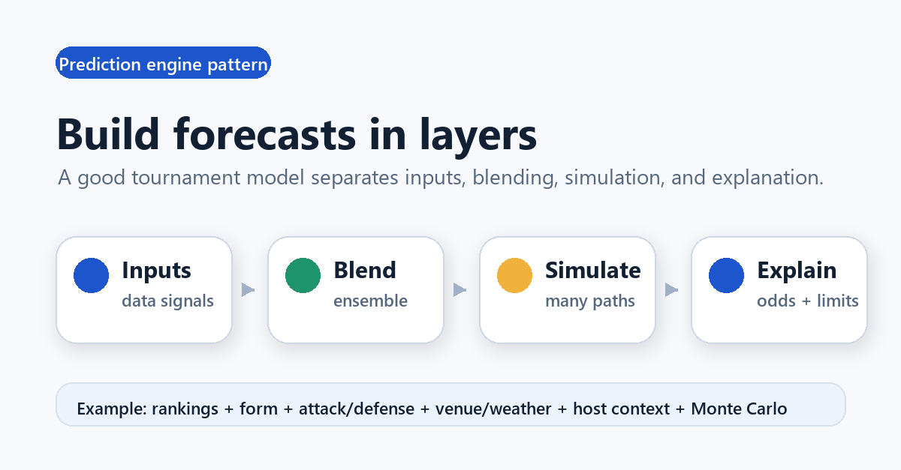
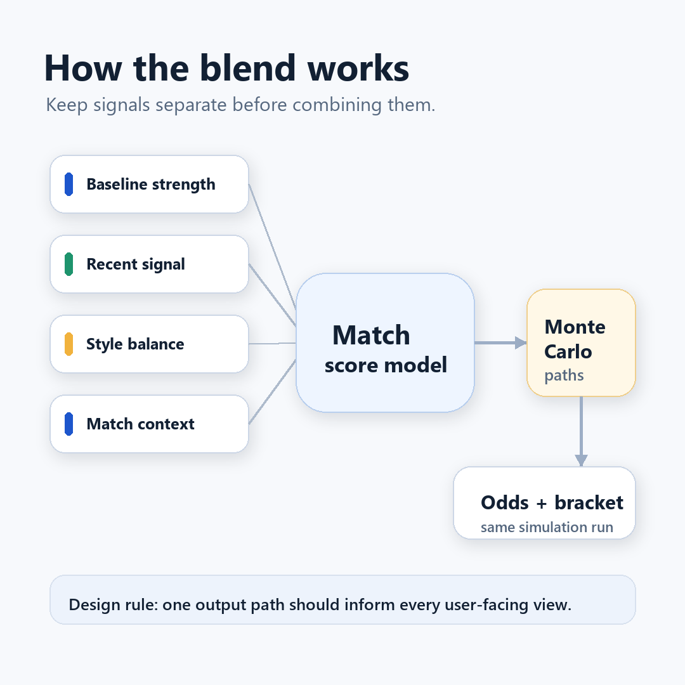
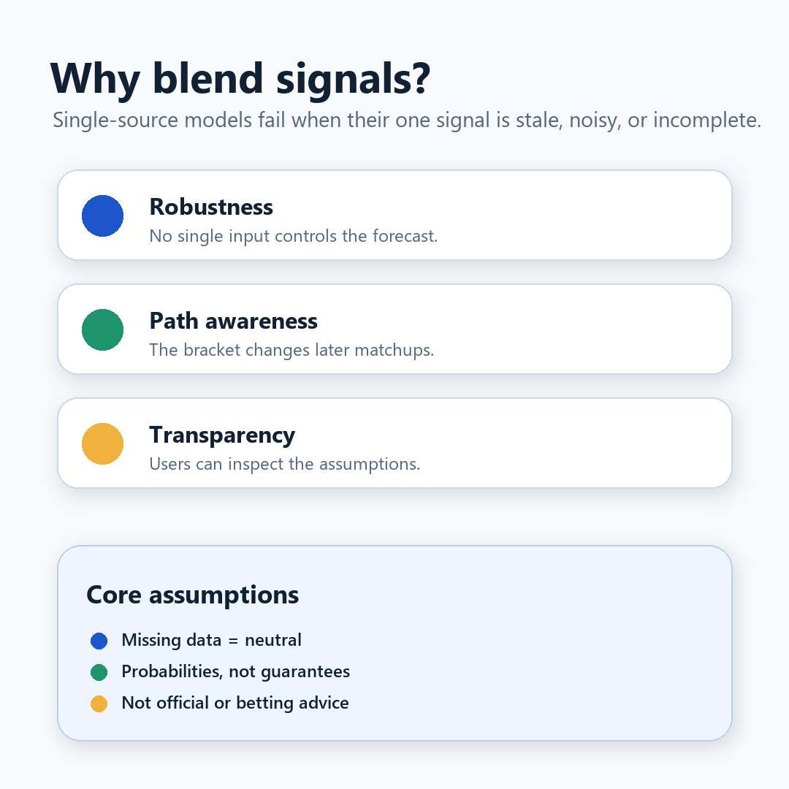

# LinkedIn Post Package: Building Prediction Engines

Source basis: current project README and `docs/assets/simulator-dashboard.png`.

## Post Copy

**Good prediction engines are built like audit trails, not black boxes.**

For tournament forecasting, I would avoid betting everything on one signal.

- Start with stable priors, then layer recent and contextual signals.
- Blend inputs so one noisy source cannot dominate.
- Simulate complete tournament paths, not isolated matches.
- Publish assumptions so users can challenge the forecast.

This World Cup 2026 simulator applies that pattern with ranking prior, form, attack/defense, venue/weather, host context, scoreline sampling, and Monte Carlo aggregation.

The advantage over a single-signal model is resilience: weak spots in one input can be checked by the others.

Assumptions stay explicit: missing reliable data is neutral, probabilities are not guarantees, and the output is not official FIFA data.

Disclaimer: This is educational simulation content, not betting, gambling, financial, investment, or prediction-market advice. Do not use it to place bets, trade contracts, or risk money.

Try the demo, then inspect the How, Health, Sources, and Checks sections before trusting the prediction: https://shfqrkhn.github.io/FIFA-WC-Sim/

## Visuals

### 1. Build Forecasts In Layers

Alt text: Clean diagram showing prediction engine layers: inputs, blend, simulate, and explain.

### 2. How The Blend Works

Alt text: Diagram showing baseline strength, recent signal, style balance, and match context feeding a match score model and Monte Carlo paths.

### 3. Why Blend Signals

Alt text: Diagram explaining blending benefits: robustness, path awareness, transparency, and core assumptions.
